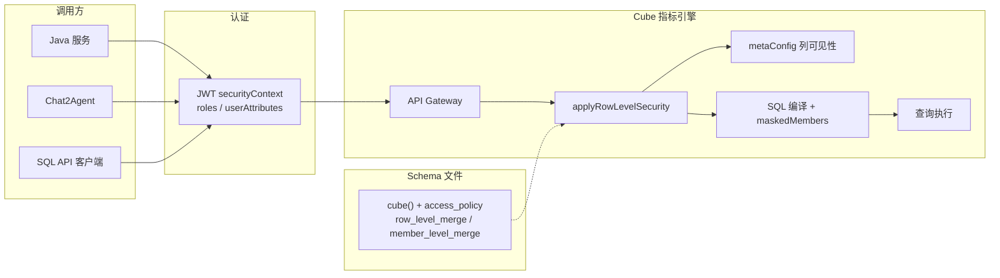

# Cube 行列权限（access_policy）方案设计

> **文档版本**：v1.0  
> **编写日期**：2026-06-25  
> **适用范围**：GienBI 指标平台（Java 配置端 + Cube 指标引擎 + Datart 权限模型）  
> **文档目的**：供技术与管理评审，说明行列权限下沉至 Cube 的产品目标、架构设计、核心语义及与 Datart 的对接方式  
> **实现基线**：Cube fork `v1.6.61`（`@cubejs-backend/server-core` / `schema-compiler`）

---

## 1. 背景与目标

### 1.1 现状与问题

当前智能问数、报表等场景的数据权限主要依赖 **Datart** 在应用层维护行列权限，查询链路大致为：

```
用户 → Java / Chat2Agent → Cube API → 数仓
                ↑
         Datart 行列权限（应用层）
```

存在以下问题：

| 问题 | 影响 |
|------|------|
| 权限未下沉至语义层 | Java 直连、SQL API、REST API 等多入口需各自实现或绕过权限，存在一致性风险 |
| 权限与 Cube Schema 分离 | 指标模型变更后，行列规则需人工同步，运维成本高 |
| 多角色合并语义不清晰 | 行权限交集/并集、列权限多角色并存时行为难以预期 |
| 脱敏与禁用列混用 | `includes: '*'` 与 `member_masking` 配置不当会导致脱敏失效 |

### 1.2 建设目标

| 目标 | 说明 |
|------|------|
| **权限下沉** | 行列权限在 Cube 查询编译阶段统一生效，覆盖 REST / SQL API 及 Java 直连 |
| **Datart 语义对齐** | 支持 Datart 风格的 `access_policy`：列权限（`member_level`）、行权限（`row_level`）、脱敏（`member_masking`） |
| **行列解耦** | 行、列策略可配置在独立的 `access_policy` 条目上，同时生效时取 **AND** |
| **可配置合并策略** | 多角色时行权限支持 AND/OR；列权限默认 AND |
| **默认放行** | 用户未命中任何 policy 时默认放行（可配置），与 Datart「无规则不限制」一致 |
| **Schema 落盘** | 权限规则由 Java 生成器写入 Cube Schema，与现有指标落盘机制一致 |

### 1.3 预期收益

- **安全一致性**：任意 API 入口查询均经过同一套 RBAC 编译逻辑
- **配置闭环**：Datart 权限变更 → Java 生成 Schema → Cube reload，无需多系统手工对齐
- **可测试性**：提供跨库集成测试（PostgreSQL / MySQL / Doris / GBase / DM），34+ 场景用例覆盖

---

## 2. 总体架构

### 2.1 权限生效链路



### 2.2 职责划分

| 层级 | 职责 |
|------|------|
| **Datart / Java 配置端** | 维护主体-行/列授权关系；生成 `access_policy` 及合并策略；签发带 `roles` 的 JWT |
| **Cube Schema** | 承载 `access_policy`、`row_level_merge`、`member_level_merge`、维度 `mask` 定义 |
| **Cube server-core** | 按用户上下文匹配 policy，合并行列权限，改写查询 filters / maskedMembers |
| **Cube schema-compiler** | 校验 Schema、编译 `mask.sql`、生成可执行 SQL |
| **API Gateway** | 查询前调用 `applyRowLevelSecurity`，拒绝越权列访问 |

### 2.3 与现有落盘机制的关系

延续 **方案 B（构建时 Schema 文件生成）**：Java 作为唯一配置源，扩展 Schema 生成器，在 `cube()` 定义中追加 `access_policy` 等字段，Cube 启动时读取静态文件编译，**不改变**现有指标/模型落盘主链路。

---

## 3. 核心概念与数据模型

### 3.1 access_policy 结构

每个 Cube 可定义多条 `access_policy`，每条绑定一个 **role**（或 group），描述该角色对本 Cube 成员的访问规则：

```yaml
cubes:
  - name: sales
    sql_table: public.sales

    # 多角色合并策略（与 access_policy 同级，per-cube）
    row_level_merge: and      # 行：多 policy 取交集（默认 or）
    member_level_merge: and   # 列：多 policy 取交集（默认 and）

    dimensions:
      - name: amount
        sql: amount
        type: number
        mask: -1              # 脱敏表达式（见 3.4）

    access_policy:
      # 列权限：ROLE_A 禁止查看 secret_col
      - role: ROLE_A
        member_level:
          includes: "*"
          excludes: [secret_col]

      # 行权限：ROLE_B 仅可见 id < 100 的行
      - role: ROLE_B
        row_level:
          filters:
            - member: id
              operator: lt
              values: ["100"]

      # 列脱敏：ROLE_C 对 masked_col 脱敏访问
      - role: ROLE_C
        member_level:
          includes: "*"
          excludes: [masked_col]
        member_masking:
          includes: [masked_col]
```

### 3.2 列访问三级语义

对每个维度/指标，单条 policy 贡献以下访问级别之一：

| 级别 | 含义 | 判定条件 |
|------|------|----------|
| **plain** | 明文可见 | `member_level.includes` 包含该成员且未 `excludes` |
| **masked** | 脱敏可见 | 非 plain，且 `member_masking.includes` 包含该成员 |
| **denied** | 不可见 | 有 `member_level` 定义但不满足 plain/masked |

Meta API 中 `plain` 与 `masked` 均为 `isVisible: true`；查询时 `masked` 成员进入 `maskedMembers` 列表，SQL 层替换为 mask 值。

### 3.3 运行模式：解耦 vs 耦合

系统自动识别 Cube 上 policy 的编排方式：

| 模式 | 识别条件 | 行列关系 |
|------|----------|----------|
| **解耦模式** | 不存在「同一条 policy 同时含列权限 + 行权限」 | 列 policy 与行 policy **分条配置**；最终约束为 **行 AND 列** |
| **耦合模式** | 至少一条 policy 同时含 `member_level` 与 `row_level` | 沿用 Cube 原生「二维矩形」语义（行+列绑定在同一 policy） |

**Datart 对接推荐解耦模式**：列授权、行授权分别生成独立 `access_policy` 条目，语义清晰，与 Datart 表结构（`rel_subject_columns` / `rel_subject_rows`）一一对应。

### 3.4 脱敏设计

脱敏分两层配置，不可混淆：

| 层级 | 配置位置 | 作用 |
|------|----------|------|
| **脱敏表达式** | 维度/指标的 `mask` 或 `mask.sql` | 定义脱敏后的值（如 `-1`、`***`、自定义 SQL） |
| **脱敏授权** | `access_policy.member_masking` | 定义哪个角色对该列走脱敏 |

**关键规则**：

1. 启用脱敏时，`member_level` 必须 **exclude** 该列，再用 `member_masking.includes` 包含，否则 `includes: '*'` 会先判为 plain，脱敏不触发。
2. 同一维度只有 **一份** `mask` 定义；不同角色需要不同脱敏值时，在 `mask.sql` 中按 `SECURITY_CONTEXT.roles` 或 `userAttributes` 分支（见 5.3）。
3. 多角色并存时列合并默认为 **AND**，避免某角色的 `includes: '*'` 盖掉其他角色的脱敏。

---

## 4. 多角色合并语义

### 4.1 合并策略配置优先级

`row_level_merge` / `member_level_merge` 解析优先级（高 → 低）：

1. Cube Schema 字段（`rowLevelMerge` / `memberLevelMerge` 或 snake_case）
2. `securityContext.variables.*`
3. `securityContext.*`
4. `cube.meta.datartPermission.*`（兼容字段）
5. **默认值**：行 `or`，列 `and`

### 4.2 行权限合并（解耦模式）

多条 **仅含行过滤** 的 policy 命中时，按 `row_level_merge` 合并后注入查询 `filters`：

| 策略 | 语义 | 典型场景 |
|------|------|----------|
| **OR**（默认） | 任一角色可见行集合的 **并集** | 销售看北区 OR 经理看全部老客户 |
| **AND** | 各角色行集合的 **交集** | 同时满足「id < 30」且「id ≥ 10」 |

### 4.3 列权限合并（解耦模式）

多条 **仅含列权限** 的 policy 命中时，按 `member_level_merge` 对每个成员合并访问级别：

| 策略 | 语义 | 产品决策 |
|------|------|----------|
| **AND**（默认） | 所有角色均 plain 才明文；任一 denied 则禁止；否则 masked | **列权限不存在 OR 合并**，与 Datart 安全模型一致 |
| OR（仅 Schema 显式配置） | 实现保留，默认不启用、不测试 | 不推荐 |

**AND 合并真值表（简化）**：

| 角色 A | 角色 B | 合并结果 |
|--------|--------|----------|
| plain | plain | plain |
| plain | masked | masked |
| plain | denied | denied |
| masked | masked | masked |
| denied | * | denied |

### 4.4 行列组合

解耦模式下：**最终可见数据 = 行权限过滤后的行集 ∩ 列权限允许的成员集**。  
查询同时引用禁用列时，整查询拒绝（`denied: true` 或 `1 = 0` segment）。

---

## 5. 与 Datart 的映射

### 5.1 概念对照

| Datart | Cube |
|--------|------|
| 主体（用户/角色/部门） | JWT `securityContext.roles`（经 `contextToRoles` 映射） |
| `rel_subject_columns` 列授权 | `access_policy[].member_level` / `member_masking` |
| `rel_subject_rows` 行脚本 | `access_policy[].row_level.filters` |
| 列脱敏规则 | 维度 `mask` + `member_masking` |
| 多主体列合并 | `member_level_merge: and`（默认） |
| 多主体行合并 | `row_level_merge: and` / `or` |
| 无匹配规则 | `CUBEJS_ACCESS_POLICY_DEFAULT_ALLOW_WHEN_NO_MATCH=true` |

### 5.2 JWT 与 cube.js 配置

```javascript
// cube.js
module.exports = {
  contextToRoles: async (context) => context.securityContext.roles || [],
  // ...
};
```

JWT 示例：

```json
{
  "securityContext": {
    "roles": ["ROLE_sales_north", "ROLE_mask_viewer"],
    "userAttributes": {
      "deptId": "D001"
    }
  }
}
```

### 5.3 多角色不同脱敏规则

`access_policy` **不支持** per-role 的独立 mask 表达式。推荐两种对接方式：

**方式 A：Schema 生成时合并（推荐）**

Java 从 Datart 读取各主体的脱敏规则，生成一条 `mask.sql`：

```javascript
mask: {
  sql: ({ SECURITY_CONTEXT }) => {
    const hasRole = (role) => SECURITY_CONTEXT.roles.filter((roles) => {
      const list = Array.isArray(roles) ? roles : [roles];
      return list.includes(role) ? 'TRUE' : 'FALSE';
    });
    return `CASE
      WHEN ${hasRole('ROLE_A')} THEN '-1'
      WHEN ${hasRole('ROLE_B')} THEN '***'
      ELSE '***'
    END`;
  },
},
```

**方式 B：JWT 下发脱敏类型**

Java 签发 Token 时计算有效脱敏样式写入 `userAttributes`，`mask.sql` 读取该字段，避免 SQL 中硬编码角色名。

用户同时拥有多角色时，脱敏值由 `CASE WHEN` **顺序**决定，需在生成逻辑中定义优先级。

---

## 6. 环境变量

| 变量 | 默认值 | 说明 |
|------|--------|------|
| `CUBEJS_ACCESS_POLICY_DEFAULT_ALLOW_WHEN_NO_MATCH` | `true` | 无匹配 policy 时默认放行 |
| `CUBEJS_ACCESS_POLICY_MASK_NUMBER` | — | 数值型成员无 `mask` 时的默认脱敏值 |
| `CUBEJS_ACCESS_POLICY_MASK_STRING` | — | 字符串型默认脱敏值 |
| `CUBEJS_ACCESS_POLICY_MASK_BOOLEAN` | — | 布尔型默认脱敏值 |
| `CUBEJS_ACCESS_POLICY_MASK_TIME` | — | 时间型默认脱敏值 |

---

## 7. 代码改动范围

### 7.1 核心模块

| 模块 | 路径 | 改动摘要 |
|------|------|----------|
| 权限引擎 | `packages/cubejs-server-core/src/core/CompilerApi.ts` | 解耦/耦合模式识别；行列合并；`applyRowLevelSecurity`；`patchVisibilityByAccessPolicy` |
| 环境变量 | `packages/cubejs-backend-shared/src/env.ts` | `accessPolicyDefaultAllowWhenNoMatch` 等 |
| Schema 校验 | `packages/cubejs-schema-compiler/src/compiler/CubeValidator.ts` | `rowLevelMerge` / `memberLevelMerge` 校验 |
| Schema 类型 | `CubeSymbols.ts` / `CubeEvaluator.ts` | 类型定义与 YAML camelize |
| API 网关 | `packages/cubejs-api-gateway/src/gateway.ts` | 查询链路接入 `applyRowLevelSecurity`（既有集成） |

### 7.2 查询编译关键路径

```
API 请求
  → normalizeQuery
  → applyRowLevelSecurity(query, context)
       ├─ getApplicablePolicies（按 roles 匹配）
       ├─ 列：resolveMergedColumnAccess → denied / maskedMembers
       └─ 行：合并 row_level.filters → query.filters
  → getSql（maskedMembers 参与 SQL 生成）
  → executeQuery
```

Meta 请求走 `metaConfig` → `patchVisibilityByAccessPolicy`，按合并后的列访问级别设置 `isVisible`。

---

## 8. 测试与质量保障

### 8.1 测试分层

| 层级 | 位置 | 覆盖 |
|------|------|------|
| 单元测试 | `packages/cubejs-server-core/test/unit/CompilerApi.test.ts` | 列合并 helper、merge 策略解析 |
| Birdbox | `packages/cubejs-testing/test/smoke-rbac.test.ts` | SQL API 端到端（Datart 风格 fixture） |
| 跨库集成 | `cubejs/test/rbac-access-policy.integration.test.js` | 34 条场景，支持 PG/MySQL/Doris/GBase/DM |

### 8.2 集成测试主要场景

| # | 场景 |
|---|------|
| 1 | 无匹配 policy → 默认放行 |
| 2 | 单列 `member_level` 禁止 |
| 3 | 行列解耦，行过滤 + 列脱敏同时生效 |
| 4 | 多角色列权限 AND 合并（默认） |
| 5–6 | 行权限 AND / OR 合并 |
| 7 | 列 AND + `member_masking` 脱敏 |
| 8 | 耦合模式（同条 policy 含行列） |
| 9 | Schema 级 merge 优先于 JWT variables |
| 10 | 行列同查：行过滤 + 列禁用 + 列脱敏 |
| 11 | 策略矩阵：5 行 + 5 禁用列 + 5 脱敏列，多角色组合 |

详细说明见 `cubejs/doc/rbac-access-policy-integration-test.md`。

---

## 9. 已知限制与风险

| 项 | 说明 | 缓解措施 |
|----|------|----------|
| 条件脱敏（按行 CASE WHEN） | 仅 **耦合模式** 支持（同条 policy 含 `member_level` + `row_level`）；解耦模式为整列统一脱敏 | Datart 若需按行脱敏，生成时合并为耦合 policy，或业务上接受整列脱敏 |
| 每成员单一 mask 表达式 | 不同角色不同脱敏值需 `mask.sql` 分支或 `userAttributes` | Java 生成器统一产出 `mask.sql` |
| 列 OR 合并 | 实现保留但默认 `and`，产品不使用 | 文档与测试已对齐 |
| 聚合指标 + 条件脱敏 | GROUP BY 不含行过滤成员时，聚合指标可能渲染为 mask 值 | 查询已含等价行过滤时可自动 unmask（已有优化） |
| Fork 与上游 | 基于 Cube `v1.6.61` fork，rebase 时需合并 RBAC 改动 | 参考 `docs/internal/b1.6.22-3.2.0-rebase-v1.6.61-*.md` |

---

## 10. 实施建议与后续规划

### 10.1 本期（已完成 / 评审中）

- [x] Cube 侧 `access_policy` 解耦行列、合并策略、默认放行
- [x] Schema 级 `row_level_merge` / `member_level_merge`
- [x] 列权限默认 AND；集成测试与 Birdbox 用例
- [ ] **领导评审本方案**
- [ ] Java Schema 生成器对接 Datart 权限表
- [ ] 预发环境联调（Java + Cube + Chat2Agent）

### 10.2 下期（建议）

| 项 | 说明 |
|----|------|
| 生成器自动化 | Datart 权限变更 → 自动生成 `access_policy` + `mask.sql` |
| 权限审计日志 | 记录 denied / masked 命中，便于合规审计 |
| 性能评估 | RBAC 编译缓存（已有 per-cube per-context cache）压测 |
| 产品文档 | 配置端操作手册与权限排查指南 |

---

## 11. 评审要点（摘要）

供管理层快速决策：

1. **是否认可权限下沉至 Cube**：一次实现、多入口一致，Java 侧聚焦配置与 Token 签发。
2. **是否认可列权限默认 AND**：符合最小权限原则，避免多角色 OR 放大列可见范围。
3. **是否认可脱敏「表达式在 Schema、授权在 policy」**：与 Cube 原生模型一致，Java 生成器负责合并多角色 mask 规则。
4. **是否认可无匹配 policy 默认放行**：与 Datart 一致，可通过环境变量改为默认拒绝。

---

## 附录 A：相关文件索引

| 类型 | 路径 |
|------|------|
| 设计文档（本文） | `docs/internal/Cube行列权限-access_policy-方案设计.md` |
| 集成测试说明 | `cubejs/doc/rbac-access-policy-integration-test.md` |
| 集成测试用例 | `cubejs/test/rbac-access-policy.integration.test.js` |
| 核心实现 | `packages/cubejs-server-core/src/core/CompilerApi.ts` |
| Birdbox 用例 | `packages/cubejs-testing/test/smoke-rbac.test.ts` |
| Datart 风格 fixture | `packages/cubejs-testing/birdbox-fixtures/rbac/model/cubes/datart_rbac_test.yaml` |

## 附录 B：Schema 配置速查

```javascript
cube(`sales`, {
  sql: `SELECT * FROM sales`,

  row_level_merge: `and`,       // 可选，默认 or
  member_level_merge: `and`,    // 可选，默认 and

  access_policy: [
    {
      role: `ROLE_col`,
      member_level: { includes: `*`, excludes: [`secret`] },
      member_masking: { includes: [`masked_col`] },
    },
    {
      role: `ROLE_row`,
      row_level: {
        filters: [{ member: `id`, operator: `lt`, values: [`100`] }],
      },
    },
  ],

  dimensions: {
    masked_col: { sql: `col`, type: `number`, mask: -1 },
    secret: { sql: `secret`, type: `string` },
  },
});
```
