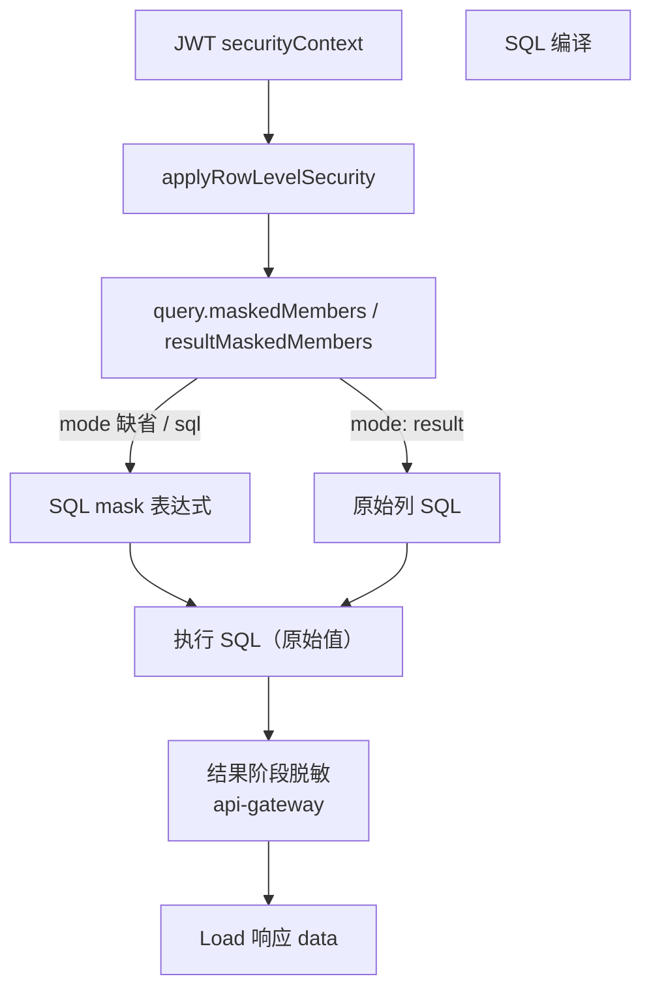

# Cube 行列权限 — 脱敏（SQL 阶段 `mask` 与结果阶段 `result_mask`）说明

> **文档版本**：v2.0  
> **编写日期**：2026-07-01  
> **适用范围**：GienBI 指标平台（Java Schema 生成器 + Cube fork `v1.6.61`）  
> **对接方**：Java 后端、Datart 权限模型、前端图表渲染  
> **对齐文档**：《Cube 结果阶段脱敏规则枚举与配置设计》  
> **相关文档**：[access_policy 方案设计](./Cube行列权限-access_policy-方案设计.md)、[Load 接口响应说明](./Cube行列权限-Load接口响应说明.md)

---

## 1. 背景与两阶段脱敏

Datart 列权限已从 `rel_subject_columns` 生成 Cube `access_policy.member_masking`。现有链路主要面向 **SQL 阶段脱敏**：生成端把部分规则翻译为成员 `mask` / `mask.sql`，Cube 在 SQL 编译时替换表达式。

**结果阶段脱敏**新增一条并行链路：查询仍按**原始表达式**执行（GROUP BY / 聚合不受影响），在返回 `data` 前再根据 `result_mask` 对指定 member 做脱敏。这样可以为 `NAME`、`PHONE`、`REGEX`、`CHAR_REPLACE` 等 Java 已有规则保留完整协议空间，避免把所有规则强行翻译为数据库方言 SQL。

| 阶段 | 配置入口 | 执行时机 | 典型场景 |
|------|----------|----------|----------|
| **SQL 阶段** | 成员 `mask` / `mask.sql` + `member_masking`（无 `mode: "result"`） | SQL 编译 | 简单静态 mask、历史兼容 |
| **结果阶段** | `member_masking.mode: "result"` + `member_masking.rules[].result_mask` | Load 返回前 | 姓名/手机/身份证/正则等复杂规则 |



---

## 2. `result_mask` 总体协议

### 2.1 推荐挂载位置

**推荐**把结果阶段脱敏规则挂在 `access_policy.member_masking.rules` 下，而不是只放在 member 定义上。同一 Cube member 在不同 role、group、condition 下可能适用不同脱敏规则；member 级 `result_mask` 仅作全局兜底（可选），**policy 内 `rules` 优先生效**。

### 2.2 字段定义

| 字段 | 类型 | 必填 | 说明 |
| --- | --- | --- | --- |
| `member_masking.mode` | string | 否 | 脱敏阶段。`"result"` = 仅结果阶段；缺省 = 旧 SQL 阶段行为 |
| `member_masking.includes` | string[] | 是 | 当前 policy 命中后允许以脱敏结果返回的 Cube member |
| `member_masking.rules` | object[] | 否 | 当前 policy 下的 member 级脱敏规则 |
| `rules[].member` | string | 是 | 规则绑定的 Cube member，需与 `includes` 一致 |
| `rules[].result_mask.type` | string | 是 | 脱敏规则枚举，对应 Java `DesensitizationType` |
| `rules[].result_mask.desensitize_type` | string | 建议必填 | 不满足规则时的兜底：`NO_DESENSITIZE` 或 `FULL_DESENSITIZE` |
| `rules[].result_mask.config` | object | 是 | 规则配置，对应 Java `ColumnRuleEntity.ruleConfig`；无配置规则用 `{}` |

`result_mask` **只描述结果值转换**，不承载 SQL 片段，也不自动消费 `mask.sql`。

### 2.3 `desensitize_type` 语义

| 值 | 含义 |
| --- | --- |
| `NO_DESENSITIZE` | 输入不满足规则时返回**原值** |
| `FULL_DESENSITIZE` | 输入不满足规则时按规则自己的全脱敏方式处理（多数规则按输入长度生成替换字符；`FULL` 规则例外） |

> `CHAR_REPLACE` 建议**始终显式传入** `desensitize_type`，避免执行器空值异常。

---

## 3. Cube Schema 配置示例（JavaScript）

### 3.1 单字段结果阶段脱敏

```js
cube(`customer`, {
  sql_table: `public.customer`,

  dimensions: {
    email: {
      sql: `email`,
      type: `string`,
    },
  },

  access_policy: [
    {
      role: `*`,
      conditions: [
        {
          if: (SECURITY_CONTEXT) =>
            (SECURITY_CONTEXT.roles || []).includes(`user:user-001`),
        },
      ],
      member_level: {
        includes: `*`,
        excludes: [`email`],
      },
      member_masking: {
        mode: `result`,
        includes: [`email`],
        rules: [
          {
            member: `customer.email`,
            result_mask: {
              type: `EMAIL`,
              desensitize_type: `NO_DESENSITIZE`,
              config: {},
            },
          },
        ],
      },
    },
  ],
});
```

### 3.2 多字段多规则结果阶段脱敏

```js
cube(`customer`, {
  sql_table: `public.customer`,

  dimensions: {
    phone: {
      sql: `phone`,
      type: `string`,
    },
    id_card: {
      sql: `id_card`,
      type: `string`,
    },
  },

  access_policy: [
    {
      role: `*`,
      conditions: [
        {
          if: (SECURITY_CONTEXT) =>
            (SECURITY_CONTEXT.roles || []).includes(`group:sales`),
        },
      ],
      member_level: {
        includes: `*`,
        excludes: [`phone`, `id_card`],
      },
      member_masking: {
        mode: `result`,
        includes: [`phone`, `id_card`],
        rules: [
          {
            member: `customer.phone`,
            result_mask: {
              type: `PHONE`,
              desensitize_type: `FULL_DESENSITIZE`,
              config: {},
            },
          },
          {
            member: `customer.id_card`,
            result_mask: {
              type: `ID_CARD`,
              desensitize_type: `NO_DESENSITIZE`,
              config: {},
            },
          },
        ],
      },
    },
  ],
});
```

### 3.3 自定义规则（KEEP_PREFIX_SUFFIX）

```js
member_masking: {
  mode: `result`,
  includes: [`account`],
  rules: [
    {
      member: `customer.account`,
      result_mask: {
        type: `KEEP_PREFIX_SUFFIX`,
        desensitize_type: `FULL_DESENSITIZE`,
        config: {
          keepFirstCount: 4,
          keepLastCount: 2,
          replaceChar: `*`,
        },
      },
    },
  ],
},
```

### 3.4 SQL 阶段脱敏（旧链路，保持兼容）

未配置 `member_masking.mode: "result"` 时，继续走 SQL 阶段 `mask`：

```js
cube(`sales`, {
  sql_table: `public.sales`,

  dimensions: {
    salary: {
      sql: `salary`,
      type: `number`,
      mask: -1,
      // 或 mask: { sql: () => `'***'` },
    },
  },

  access_policy: [
    {
      role: `student`,
      member_level: {
        includes: `*`,
        excludes: [`salary`],
      },
      member_masking: {
        includes: [`salary`],
        // 无 mode / rules → SQL 阶段脱敏
      },
    },
  ],
});
```

### 3.5 配置约束（与 Datart 对齐）

1. **`member_masking` 必须配合 `member_level`**
2. 启用脱敏时，该 member 应在 `member_level.excludes` 中，再用 `member_masking.includes` 包含；否则 `includes: '*'` 会先判为 **plain**，脱敏不触发
3. `member_masking.includes` 与 `member_level.excludes` 使用**同一个** Cube member
4. 同一 policy、同一 member 建议只允许**一条** `result_mask`（多规则冲突见 §8.3）
5. 同一 member **不建议**同时配置 SQL `mask` 与 `result_mask`；若并存，**结果阶段优先覆盖最终返回值**

---

## 4. `rel_subject_columns` → `result_mask` 字段映射

`column_permission` 推荐数组格式：

```json
[
  {
    "id": "dimension-id",
    "code": "customer_name",
    "modelName": "customer_name",
    "ruleType": "NAME",
    "desensitizeType": "NO_DESENSITIZE",
    "ruleConfig": {}
  }
]
```

| Datart 来源 | Cube 目标 | 说明 |
| --- | --- | --- |
| `subject_type` + `subject_id` | `access_policy.conditions` | 生成主体命中条件 |
| `is_applicable` | `access_policy.conditions` | `true` 适用；`false` 取反 |
| `rule_type` | 生成端规则分类 | `desensitization` / `masking` / `MASKING` |
| `column_permission[].id` | Cube member 定位 | 优先按语义模型维度 ID |
| `fieldCode` / `modelName` / `originName` / `name` / `code` | Cube member 定位 | ID 缺失时按字段编码匹配 |
| `column_permission[].ruleType` | `result_mask.type` | 兼容 `type`、`desensitizationType`、`maskType` |
| `column_permission[].ruleConfig.ruleType` | `result_mask.type` | 顶层缺失时从 `ruleConfig` 读取 |
| `column_permission[].desensitizeType` | `result_mask.desensitize_type` | 顶层推荐 |
| `column_permission[].ruleConfig.desensitizeType` | `result_mask.desensitize_type` | 历史兼容 |
| `column_permission[].ruleConfig` | `result_mask.config` | 原样透传 |
| 解析得到的 Cube member | `member_masking.includes` | 脱敏返回的 member |
| 解析得到的 Cube member | `member_level.excludes` | 禁止直接返回原始 member |

生成端对同一 member 多条脱敏规则：**稳定选择一条**（优先 `NAME` → `update_time` → `create_time` → `id`），并记录 warning。产品层建议保存阶段限制同一字段最多一条规则。

---

## 5. `DesensitizationType` 枚举总览

对应 Java `gienbi.server.common.enums.DesensitizationType`，共 **15** 个枚举。实现口径以处理器为准（注释与实现存在少量差异，见各节说明）。

| 枚举 | 依赖 `config` | 推荐默认 `desensitize_type` | 处理器 |
| --- | --- | --- | --- |
| `NAME` | 否 | `NO_DESENSITIZE` | `NameDesensitizationHandle` |
| `ID_CARD` | 否 | `NO_DESENSITIZE` | `IDCardDesensitizationHandle` |
| `PHONE` | 否 | `NO_DESENSITIZE` | `PhoneDesensitizationHandle` |
| `ADDRESS` | 否 | `NO_DESENSITIZE` | `AddressDesensitizationHandle` |
| `EMAIL` | 否 | `NO_DESENSITIZE` | `EmailDesensitizationHandle` |
| `BANK_CARD` | 否 | `NO_DESENSITIZE` | `BankCardDesensitizationHandle` |
| `ACCOUNT` | 否 | `NO_DESENSITIZE` | `AccountDesensitizationHandle` |
| `KEEP_PREFIX_SUFFIX` | 是 | `NO_DESENSITIZE` | `PrefixSuffixDesensitizationHandle` |
| `KEEP_RANGE` | 是 | `NO_DESENSITIZE` | `RangeDesensitizationHandle` |
| `KEEP_SPECIAL_CHAR` | 是 | `NO_DESENSITIZE` | `SpecialCharPreservingDesensitizationHandle` |
| `BEFORE_SPECIAL_CHAR` | 是 | `NO_DESENSITIZE` | `BeforeSpecialCharDesensitizationHandle` |
| `AFTER_SPECIAL_CHAR` | 是 | `NO_DESENSITIZE` | `AfterSpecialCharDesensitizationHandle` |
| `FULL` | 是 | 不适用 | `FullDesensitizationHandle` |
| `CHAR_REPLACE` | 是 | 建议显式传入 | `CharReplacerDesensitizationHandle` |
| `REGEX` | 是 | `NO_DESENSITIZE` | `RegexDesensitizationHandle` |

---

## 6. 各规则 `config` 示例与语义

以下 `config` 与 Java `ColumnRuleEntity.ruleConfig` 一致，Cube 结果阶段执行器应按相同语义实现。

### 6.1 `NAME`

```js
config: {},
```

- 长度 2：保留首字，第二字 `*`，如 `张三` → `张*`
- 长度 3：保留首尾，中间 `*`，如 `张三丰` → `张*丰`
- 长度 ≥ 4：保留前 2 位，替换第 3 位，保留后续
- 长度 0 或 1：按 `desensitize_type` 兜底

### 6.2 `ID_CARD`

```js
config: {},
```

- 仅对长度 **18** 的字符串：保留前 **6** 后 **4**，中间 `*`
- 非 18 位：`NO_DESENSITIZE` 原值 / `FULL_DESENSITIZE` 等长 `*`

### 6.3 `PHONE`

```js
config: {},
```

- 大陆 11 位（`1[3-9]` 开头）：保留前 **6** 后 **2**，中间固定 `***`
- 港澳 / 台湾 / 海外：按处理器正则分支
- 空值或无法识别：按 `desensitize_type` 兜底

### 6.4 `ADDRESS`

```js
config: {},
```

- 优先匹配省市区县等行政层级，再匹配道路关键词
- 关键词之间用 `**` 替代
- 无匹配：按 `desensitize_type` 兜底

### 6.5 `EMAIL`

```js
config: {},
```

- 要求且仅允许一个 `@`
- 用户名 ≥ 3：保留前 3 位 + `***` + 完整域名
- 用户名 < 3：完整短用户名 + `***` + 域名
- 无 `@` 或多个 `@`：按 `desensitize_type` 兜底

### 6.6 `BANK_CARD`

```js
config: {},
```

- 长度 ≥ 11：保留前 6 后 4，中间 `*`
- 长度 ≤ 10 或空：按 `desensitize_type` 兜底

### 6.7 `ACCOUNT`

```js
config: {},
```

- 长度 ≥ 9：保留前 4 后 4，中间 `*`
- 长度 < 9：按 `desensitize_type` 兜底；空字符串始终返回空

### 6.8 `KEEP_PREFIX_SUFFIX`

```js
config: {
  keepFirstCount: 3,
  keepLastCount: 4,
  replaceChar: `*`,
},
```

必填：`keepFirstCount`、`keepLastCount`、`replaceChar`。输入长度 ≤ 前缀+后缀之和时按 `desensitize_type` 兜底。

### 6.9 `KEEP_RANGE`

```js
config: {
  keepFromCount: 2,
  keepToCount: 5,
  replaceChar: `*`,
},
```

按 **1-based** 位置保留第 N 到第 M 位，前后用 `replaceChar` 替换。

### 6.10 `KEEP_SPECIAL_CHAR`

```js
config: {
  specialChars: `["-", "@"]`,
  replaceChar: `*`,
},
```

`specialChars` 为 **JSON 数组字符串**；保留这些字符，其余替换为 `replaceChar`。

### 6.11 `BEFORE_SPECIAL_CHAR`

```js
config: {
  specialChar: `@`,
  desensitizeDisplay: `*`,
},
```

分隔符**之前**全部替换为 `desensitizeDisplay`，分隔符及之后保留。

### 6.12 `AFTER_SPECIAL_CHAR`

```js
config: {
  specialChar: `@`,
  desensitizeDisplay: `*`,
},
```

分隔符及**之前**保留，之后全部替换为 `desensitizeDisplay`。

### 6.13 `FULL`

```js
config: {
  desensitizeDisplay: `***`,
},
```

直接返回 `desensitizeDisplay`，不按输入长度重复；**不依赖** `desensitize_type`。

### 6.14 `CHAR_REPLACE`

```js
config: {
  replaceRules: [
    { sourceChar: `集团`, targetChar: `**` },
    { sourceChar: `A`, targetChar: `*` },
  ],
},
```

按 `sourceChar` 长度降序贪婪匹配；未命中任何规则时按 `desensitize_type` 兜底。

### 6.15 `REGEX`

```js
config: {
  regex: `(\\d{3})\\d{4}(\\d{4})`,
  replacementString: `$1****$2`,
},
```

Java 正则 + `replaceAll`；无匹配时按 `desensitize_type` 兜底。

---

## 7. 列访问三态与授权

| 状态 | 条件 | 查询行为 |
|------|------|----------|
| **plain** | `member_level.includes` 包含且未 exclude | 明文返回 |
| **masked** | 非 plain，且 `member_masking.includes` 包含 | 进入脱敏链路（SQL 或 result） |
| **denied** | 有 `member_level` 但不满足 plain / masked | HTTP `400` + `deniedMembers` |

---

## 8. 兼容策略

### 8.1 与旧 SQL 阶段脱敏

| 配置 | 行为 |
|------|------|
| 无 `mode` / 无 `rules` / 无 `result_mask` | 保持 SQL 阶段 `mask` / `mask.sql` |
| `member_masking.mode: "result"` | 进入结果阶段；SQL 查原始值 |
| `mask.sql` | **不**自动转换为 `result_mask` |

默认 mask 环境变量（SQL 阶段无 `mask` 定义时）：

| 成员类型 | 环境变量 |
|----------|----------|
| `string` | `CUBEJS_ACCESS_POLICY_MASK_STRING` |
| `number` | `CUBEJS_ACCESS_POLICY_MASK_NUMBER` |
| `boolean` | `CUBEJS_ACCESS_POLICY_MASK_BOOLEAN` |
| `time` | `CUBEJS_ACCESS_POLICY_MASK_TIME` |

### 8.2 条件脱敏（行级 filter）

同一条 policy 同时含 `member_level` + `row_level` 时：

- **满足**行条件 → 明文
- **不满足** → 脱敏

响应中 `maskedMembers[].filter` 携带行条件；结果阶段对满足 filter 的行跳过脱敏。SQL 阶段生成 `CASE WHEN ... THEN 原值 ELSE mask END`（聚合场景有 GROUP BY 优化）。

### 8.3 多规则冲突（生成端兜底）

1. 优先 `NAME`
2. `update_time` 倒序
3. `create_time` 倒序
4. `id` 排序

---

## 9. 端到端链路（结果阶段）

```text
1. POST /cubejs-api/v1/load（客户端不可传 maskedMembers）
2. CompilerApi.applyRowLevelSecurity
   ├─ denied → 400 + deniedMembers
   └─ masked → query.maskedMembers / resultMaskedMembers
3. mode !== "result" → SQL 编译应用 mask
   mode === "result" → SQL 使用原始列，不进入 SQL mask
4. 执行 SQL
5. Gateway 结果转换：按 rules[].result_mask 改写 data
6. 返回 200 + maskedMembers + data
```

| 接口 | 执行查询 | 返回 data | 结果阶段脱敏 |
|------|----------|-----------|--------------|
| `/v1/load` | 是 | 是 | 是（`mode: "result"`） |
| `/v1/sql` | 否 | 否 | 否（仅编译 SQL） |

---

## 10. Load 响应示例

```json
{
  "query": {
    "dimensions": ["customer.email"],
    "maskedMembers": [
      {
        "member": "customer.email",
        "title": "customer 邮箱",
        "displayTitle": "邮箱"
      }
    ]
  },
  "data": [
    { "customer.email": "use***@example.com" }
  ]
}
```

---

## 11. Cube 改造点（实现清单）

| 改造点 | 建议内容 |
| --- | --- |
| `CubeValidator.ts` | 扩展 `MemberMaskingPolicySchema`：`mode`、`rules`、`result_mask`、`desensitize_type` |
| `CubeSymbols.ts` | 扩展 `AccessPolicyDefinition.memberMasking` 类型 |
| `CompilerApi.ts` | 区分 SQL `maskedMembers` 与结果 `resultMaskedMembers` |
| `BaseQuery.js` | `mode: "result"` 时不进入 SQL mask |
| `api-gateway` | 按 `rules[].result_mask` 执行 15 种 `DesensitizationType` |
| `ResultWrapper` / Rust transport | default / compact / columnar / multi query 同步支持 |

> **注意**：`streaming` 首期可能不支持结果脱敏，需在协议或文档中明确限制。

---

## 12. 常见问题

**Q：对谁生效？**  
仍由 `member_masking.includes` + 当前用户命中的 `access_policy` 决定；`rules` 只定义「怎么脱」。

**Q：不同 role 不同脱敏规则？**  
在各自 policy 的 `member_masking.rules` 中配置不同 `result_mask`，不要依赖 member 级单一配置。

**Q：只配 `result_mask`、GROUP BY 是否正常？**  
是。`mode: "result"` 时 SQL 用原始值聚合，脱敏在返回前完成。

**Q：客户端能否传 `maskedMembers`？**  
不能，返回 `400`：`maskedMembers cannot be provided in the query`。

---

## 13. 变更记录

| 版本 | 日期 | 说明 |
|------|------|------|
| v1.0 | 2026-06-24 | 初始版：member 级 `result_mask` + 内置 FIRST_CHAR 等策略 |
| v2.0 | 2026-07-01 | 对齐 Java 协议：`member_masking.mode` / `rules` / `desensitize_type`；15 种 `DesensitizationType`；示例全部改为 JS |
