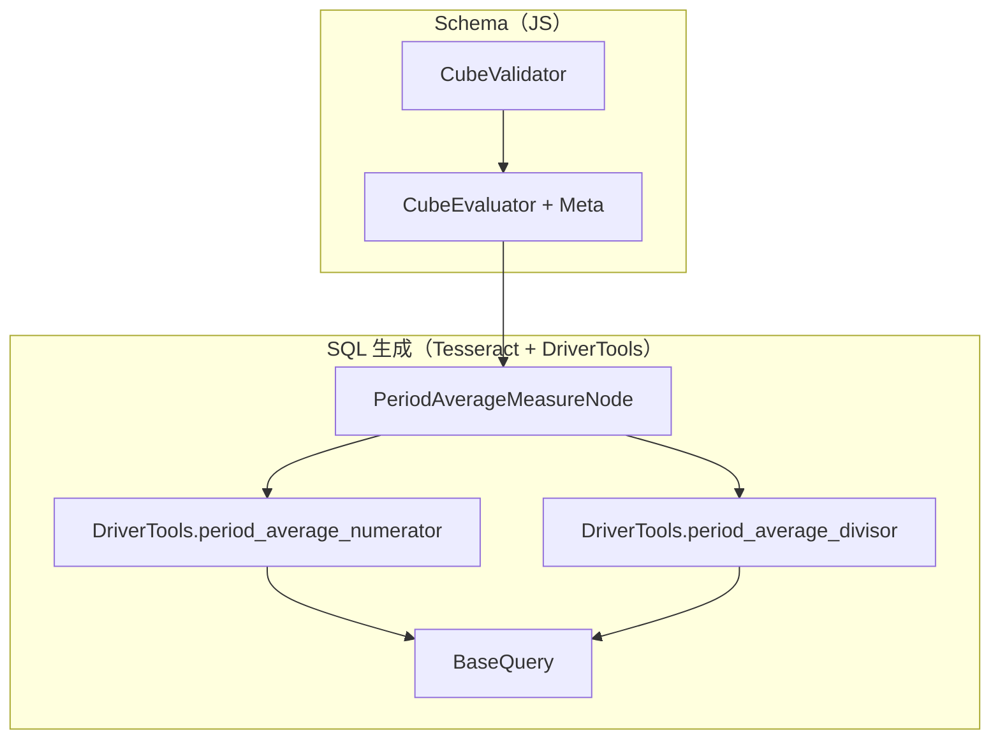

# period_average 原生参数 — 设计方案

> **文档状态**：Draft v3.0  
> **创建日期**：2026-07-13  
> **最后修订**：2026-07-14  
> **需求基线**：[period_average-需求说明.md](./period_average-需求说明.md) v1.0  
> **适用范围**：Cube Core（schema-compiler + Tesseract SQL Planner）  
> **前置条件**：`CUBEJS_TESSERACT_SQL_PLANNER=true`（必须）

---

## 1. 设计目标

实现需求 v1.0 定义的 **`period_average`**：

1. `type: number` measure 引用基础 measure（`sum` / `count` / `avg`）；
2. Schema 配置 **`avg_unit`** + **`interval`** + **`denominator`** + **`time_dimension`**；
3. **指标语义由配置固定**；查询 `granularity` 仅决定分组方式（整区间 / 区间内累计 / 形态 B）；
4. 公式：`{分子} / NULLIF(分母, 0)`，累计查看时分子为窗口 `SUM`。

**非目标（MVP）**：`week` / `hour`、Calendar Cube、Fiscal 历、Legacy JS Planner、period_average 的 pre-aggregation。

---

## 2. 需求映射

| 需求概念 | 设计落点 |
|---------|---------|
| `avg_unit` + `interval` 固定语义 | `PeriodAverageConfig` 编译归一化；Rust `PeriodAverage.avg_unit` / `.interval` |
| 整区间查看 | `periodAverageViewMode → interval_bucket` |
| 区间内累计查看 | `periodAverageViewMode → cumulative` + `periodAverageNumerator` 窗口 SUM |
| 形态 B | `periodAverageViewMode → range` |
| `denominator: calendar` | `periodAverageCalendarBucketDivisor` / `periodAverageCumulativeCalendarDivisor` |
| `denominator: data` | `COUNT(DISTINCT …)`（整区间）或 `COUNT(*) OVER (…)`（累计） |
| 查询粒度校验 | `periodAverageValidateQueryGranularity` |
| `avg` 基础 measure | 分子 `AVG`，再除周期分母 |

---

## 3. 总体架构



### 3.1 职责划分

| 组件 | 职责 |
|------|------|
| **CubeValidator** | `avg_unit`/`interval`/`denominator`/`time_dimension`；`unit`→`avg_unit` 别名 |
| **CubeEvaluator** | 解析 `baseMeasure`；校验 `avg_unit` 与 `interval` 粒度序；输出 Meta |
| **PeriodAverageMeasureNode** | `numerator / NULLIF(divisor, 0)` |
| **BaseQuery.periodAverageViewMode** | 判定 `range` / `interval_bucket` / `cumulative` |
| **BaseQuery.periodAverageNumerator** | 累计查看时包装窗口 `SUM` |
| **BaseQuery.periodAverageDivisor** | 按配置 + 查看方式生成分母 SQL |

---

## 4. 数据模型

### 4.1 Schema

```yaml
period_average:
  avg_unit: day | month | quarter | year   # 或 unit 别名
  interval: day | month | quarter | year
  denominator: data | calendar
  time_dimension: created_at
```

### 4.2 Rust Bridge

```rust
#[derive(Serialize, Deserialize, Debug, Clone)]
pub struct PeriodAverage {
    #[serde(rename = "avgUnit", alias = "avg_unit")]
    pub avg_unit: String,
    pub interval: String,
    pub denominator: String,
    #[serde(rename = "timeDimension", alias = "time_dimension")]
    pub time_dimension: String,
    #[serde(rename = "baseMeasure")]
    pub base_measure: Option<String>,
    #[serde(rename = "baseAggType")]
    pub base_agg_type: Option<String>,
}
```

### 4.3 TypeScript

```typescript
export type PeriodAverageConfig = {
  avgUnit: 'day' | 'month' | 'quarter' | 'year';
  interval: 'day' | 'month' | 'quarter' | 'year';
  denominator: 'data' | 'calendar';
  timeDimension: string;
  baseMeasure?: string;
  baseAggType?: string;
};
```

---

## 5. 查看方式（ViewMode）

由 **配置的 `avg_unit` / `interval`** 与 **查询 `granularity`** 决定（**不**用查询粒度替换 `avg_unit`）：

```javascript
periodAverageViewMode(avgUnit, interval, queryGranularity) {
  if (!queryGranularity) return 'range';
  if (queryGranularity === interval) return 'interval_bucket';
  if (queryGranularity === avgUnit && avgUnit !== interval) return 'cumulative';
  return 'interval_bucket'; // avgUnit === interval
}
```

### 5.1 查询粒度 gate

```javascript
periodAverageValidateQueryGranularity(avgUnit, interval, queryGranularity) {
  if (!queryGranularity) return;
  if (['week', 'hour'].includes(queryGranularity)) throw …;
  if (queryGranularity !== interval && queryGranularity !== avgUnit) throw …;
}
```

示例：月日均（`day`/`month`）允许 `month` 或 `day`；**拒绝** `year`、`quarter`、`week`。

---

## 6. 分子设计

| 查看方式 | 分子 SQL |
|---------|---------|
| `interval_bucket` / `range` | 基础 measure 默认聚合：`SUM` / `COUNT` / `AVG` |
| `cumulative` | `SUM({AGG}) OVER (PARTITION BY {interval_bucket} ORDER BY {avg_unit_bucket} ROWS UNBOUNDED PRECEDING)` |

**PeriodAverageMeasureNode** 流程：

```rust
let inner_agg = default_processor.to_sql(base_measure);
let numerator = templates.period_average_numerator(
    inner_agg, avg_unit, interval, time_dimension, bucket_sql,
)?;
let divisor = templates.period_average_divisor(
    avg_unit, interval, denominator, time_dimension, bucket_sql, identity,
)?;
format!("({}) / NULLIF({}, 0)", numerator, divisor)
```

**MeasureSymbol**：有 `period_average` → `is_reference = false`，`is_additive = false`。

### 6.1 时点型（半累加）基础 measure

基础 measure 带 `nonAdditiveDimension` 时，**period_average 分子展开须回退为普通聚合**：

- `BaseMeasure.measureSql()` 在 `periodAverageNumerator` 上下文中跳过半累加 CTE 路径；
- `collectReferencedSemiAdditiveMeasures()` 不把「仅作为 PA 基础、未独立选中」的时点 measure 纳入半累加 CTE；
- 编译期 `normalizePeriodAverageMeasure()` 从 `sql` 写入 `baseMeasure`，供 Rust `PeriodAverageMeasureNode` 渲染。

同查规则：用户显式选中 `acct_balance_end` 等时点 measure 时仍走半累加；PA 引用同一 measure 时分子仍 `SUM(balance_snapshot)` 等，与是否同查无关。

---

## 7. 分母设计

### 7.1 整区间（`interval_bucket`）

| denominator | 分母 |
|-------------|------|
| `calendar` | `avg_unit` 在 interval 桶内的自然历计数；`avg_unit === interval` 时为 `1` |
| `data` | `COUNT(DISTINCT trunc(avg_unit, time_dimension))` 于同 GROUP BY 组 |

实现：`periodAverageCalendarBucketDivisor(avgUnit, interval, bucketColumn)` — 注意第二个参数为 **配置的 interval**，非查询粒度。

### 7.2 区间内累计（`cumulative`）

| denominator | 分母 |
|-------------|------|
| `calendar` | `calendarUnitCount(avg_unit, interval_start, current_row_date)` |
| `data` | `COUNT(*) OVER (PARTITION BY interval ORDER BY avg_unit ROWS UNBOUNDED PRECEDING)` |

实现：`periodAverageCumulativeCalendarDivisor` / `periodAverageCumulativeDataDivisor`。

### 7.3 形态 B（`range`）

| denominator | 分母 |
|-------------|------|
| `calendar` | `calendarUnitCount(avg_unit, filter_start, filter_end)` |
| `data` | `COUNT(DISTINCT trunc(avg_unit, td))` 于 filter 行集 |

---

## 8. DriverTools API

```rust
fn period_average_divisor(
    &self,
    avg_unit: String,
    interval: String,
    denominator: String,
    time_dimension: String,
    bucket_sql: Option<String>,
    identity: bool,
) -> Result<String, CubeError>;

fn period_average_numerator(
    &self,
    inner_agg_sql: String,
    avg_unit: String,
    interval: String,
    time_dimension: String,
    bucket_sql: Option<String>,
) -> Result<String, CubeError>;
```

**BaseQuery** 通过 `driverTools()` 暴露上述方法（`this` 即 DriverTools）。

方言覆盖：**MysqlQuery** 覆写 `periodAverageIntervalStartExpr`、`periodAverageGroupedBucketExpr` 等。

---

## 9. SQL 示例

### 9.1 月日均 — 整区间（granularity=month）

```sql
SUM(amount) / NULLIF(
  (bucket_end - month_start + 1),  -- calendar, avg_unit=day（桶内自然日数）
  0
)
```

### 9.2 月日均 — 区间内累计（granularity=day）

```sql
SUM(SUM(amount)) OVER (
  PARTITION BY DATE_TRUNC('month', stat_dt)
  ORDER BY DATE_TRUNC('day', stat_dt)
  ROWS BETWEEN UNBOUNDED PRECEDING AND CURRENT ROW
)
/ NULLIF(
  (current_day::date - month_start::date + 1),
  0
)
```

### 9.3 形态 B（无 granularity，unit=month，filter 4–6 月）

```sql
SUM(amount) / NULLIF(3, 0)  -- calendar: 3 个自然月
```

---

## 10. 错误处理

| 场景 | 阶段 | 消息要点 |
|------|------|---------|
| 缺 `interval` | 编译 | requires interval |
| `avg_unit` 粗于 `interval` | 编译 | must be finer than interval |
| 查询粒度 ∉ {interval, avg_unit} | 查询 | configured as avg_unit='…' over interval='…' |
| `week` / `hour` | 查询 | does not support |
| 无 granularity 且无日期 filter | 查询 | requires granularity or date range |
| 分母 0 | SQL | `NULLIF` → NULL |

---

## 11. 测试计划

### 11.1 schema-compiler 集成

`packages/cubejs-schema-compiler/test/integration/postgres/period-average.test.ts` — 需求 §8 全部场景。

### 11.2 矩阵集成

`cubejs/test/metrics-measures-matrix.integration.test.js` — `describe('period_average 周期归一化（Tesseract）')`，走 `CubejsServerCore` + 灌数；说明见 `cubejs/doc/metrics-measures-matrix-integration-test.md` §5.1。

---

## 12. 实现文件清单

| 文件 | 变更 |
|------|------|
| `packages/cubejs-schema-compiler/src/compiler/CubeValidator.ts` | `avg_unit` + `interval` schema |
| `packages/cubejs-schema-compiler/src/compiler/CubeEvaluator.ts` | 归一化 + 粒度序校验 |
| `packages/cubejs-schema-compiler/src/adapter/BaseQuery.js` | ViewMode、Numerator、Divisor |
| `packages/cubejs-schema-compiler/src/adapter/MysqlQuery.ts` | MySQL 方言 |
| `rust/.../cube_bridge/measure_definition.rs` | `PeriodAverage` 结构 |
| `rust/.../cube_bridge/driver_tools.rs` | divisor + numerator |
| `rust/.../physical_plan/sql_nodes/period_average_measure.rs` | 组装分子分母 |

---

## 13. 已确认设计决策（v3.0）

| 项 | 决策 |
|----|------|
| 需求基线 | **v1.0**（配置固定语义） |
| 分母驱动 | **`avg_unit` + `interval` + ViewMode**，非查询粒度推断 |
| 累计分子 | `period_average_numerator` 窗口 `SUM` |
| 查询粒度 | 仅 **`interval`** 或 **`avg_unit`** |
| 引擎 | 仅 Tesseract |

---

## 14. 文档修订记录

| 版本 | 日期 | 说明 |
|------|------|------|
| v1.0–v2.0 | 2026-07-13/14 | 单 `unit` + 查询粒度 gate（已废弃） |
| **v3.0** | 2026-07-14 | 对齐需求 **v1.0**：`avg_unit`+`interval`、`period_average_numerator`、ViewMode |
