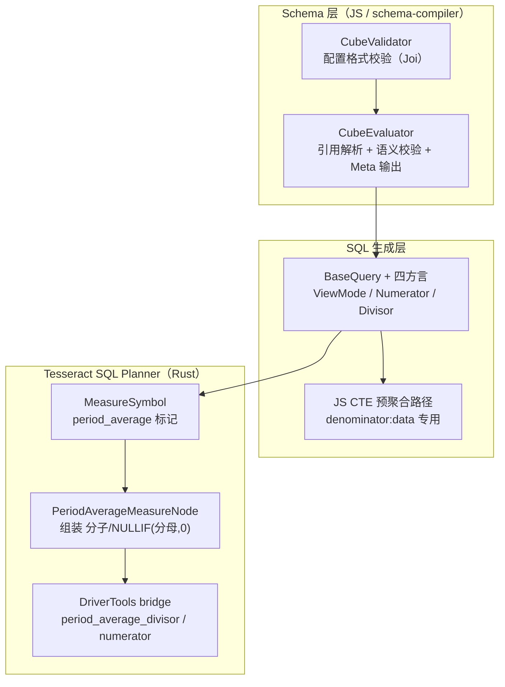

# period_average（周期归一化指标）设计方案评审稿

> **文档状态**：评审稿 v1.0
> **创建日期**：2026-07-14
> **关联实现**：提交 `61205dc1`（feat 月日均类型指标）
> **需求基线**：[period_average-需求说明.md](./period_average-需求说明.md) v1.0
> **技术设计**：[period_average-设计方案.md](./period_average-设计方案.md) v3.0
> **适用范围**：Cube Core（schema-compiler + Tesseract SQL Planner）
> **前置条件**：`CUBEJS_TESSERACT_SQL_PLANNER=true`（必须）

---

## 1. 背景与目标

### 1.1 业务问题

用户需要**周期归一化指标**，且业务上对「分母用什么」存在两种常见口径：

| 口径 | 分母含义 | 典型问题 |
|------|---------|---------|
| **有数据口径（data）** | 统计范围内**实际有数据的**日/月/季/年个数 | 「有单子的那些天，平均每天卖多少？」 |
| **自然历口径（calendar）** | 统计范围内**自然历上应计入的**日/月/季/年个数 | 「这个月按日历天数（或按已过的日历天数），日均是多少？」 |

典型如**「月日均」**（月平均区间的日均）：在**每个月**这个平均区间内，把指标归一化到**日**粒度。现有 Cube 的 `avg` / `rollingWindow` 无法表达「分子÷周期内天数」这种语义，需新增能力。

### 1.2 设计目标

引入 **`period_average`** 原生参数：在 `type: number` 的 measure 上引用基础 measure，由引擎计算 `分子 ÷ 分母`。

核心设计原则——**指标语义在 measure 定义时即固定，不由查询粒度推断**：

- 配置 `avg_unit`（归一化单位）+ `interval`（平均区间）后，该 measure 永远是同一种周期平均。
- **查询粒度**只决定**如何分组展示**（整区间 / 区间内累计 / 整段汇总），不改变 measure 的语义。
- 分母始终按 `avg_unit` + `interval` + `denominator`（口径）+ 查看方式共同计算。

### 1.3 非目标（本期不做）

- `week` / `hour` 粒度
- Calendar Cube / 财年
- Legacy JS Planner 作为主路径（calendar 口径必须走 Tesseract；data 口径因 `COUNT(DISTINCT)` 代价走 JS CTE 预聚合，见 §4.4）
- `count_distinct` / `min` / `max` 等作基础 measure
- period_average 链式引用
- period_average measure 本身的 pre-aggregation 加速

---

## 2. 用户配置（Schema API）

### 2.1 配置字段

```yaml
measures:
  - name: total_sale_price
    sql: sale_price
    type: sum

  # 月平均区间的日均（月日均）— 自然历
  - name: period_daily_avg_revenue_calendar
    sql: "{total_sale_price}"          # 引用基础 measure
    type: number                        # 必须为 number
    period_average:
      avg_unit: day                     # 归一化单位：day/month/quarter/year（或旧字段 unit）
      interval: month                   # 平均区间：day/month/quarter/year
      denominator: calendar             # 口径：data（有数据）/ calendar（自然历）
      time_dimension: created_at        # 时间维度
```

### 2.2 配置约束

| 字段 | 必填 | 取值 | 说明 |
|------|------|------|------|
| `type` | 是 | `number` | 必须为 number 类型 |
| `sql` | 是 | `{基础measure}` | 必须仅引用一个基础 measure（type 为 `sum`/`count`/`avg`） |
| `avg_unit`（或 `unit`） | 是 | `day`/`month`/`quarter`/`year` | 归一化目标单位 |
| `interval` | 是 | `day`/`month`/`quarter`/`year` | 平均区间 |
| `denominator` | 是 | `data`/`calendar` | 分母口径 |
| `time_dimension` | 是 | `<string>` | 时间维度 |

**编译期约束**（不满足则编译/查询报错）：

| 约束 | 校验阶段 | 行为 |
|------|---------|------|
| `avg_unit` 细于 `interval` 不成立，且二者不等 | 编译期 | 报错 |
| `avg_unit`/`interval` 为 `week` | 编译期 | 报错（MVP 不支持） |
| 与 `rolling_window`/`multi_stage` 共用 | 编译期 | 报错 |
| 基础 measure 不是 `sum`/`count`/`avg` | 编译期 | 报错 |
| 引用另一个 period_average measure | 编译期 | 报错 |
| 查询 `granularity` ∉ {`interval`, `avg_unit`} | 查询期 | 报错 |
| 查询 `granularity` 为 `week`/`hour` | 查询期 | 报错 |
| 形态 B 无日期 filter | 查询期 | 报错 |

粒度序（MVP）：`day` < `month` < `quarter` < `year`。

---

## 3. 核心概念：查看方式（ViewMode）

指标语义固定后，**查询 `granularity` 决定查看方式**，共三种：

```
periodAverageViewMode(avgUnit, interval, queryGranularity):
  无 granularity + 有日期 filter   → range        （形态 B：整段汇总，单行）
  granularity === interval          → interval_bucket （整区间：每个 interval 桶一行）
  granularity === avgUnit ≠ interval → cumulative    （区间内累计：每个 avg_unit 桶一行，分区内从区间起点累计）
```

### 3.1 三种查看方式的分子 / 分母

| 查看方式 | 分子 | 分母（calendar） | 分母（data） |
|---------|------|------------------|-------------|
| **整区间**（`granularity=interval`） | 桶内基础 measure 聚合 | 桶内自然历 avg_unit 数；`avg_unit===interval` 时为 1 | 桶内有数据的 distinct avg_unit 数 |
| **区间内累计**（`granularity=avg_unit`） | `SUM(聚合) OVER (PARTITION BY interval ORDER BY avg_unit ROWS UNBOUNDED PRECEDING)` | 区间起点到当前行的自然 avg_unit 数 | 区间起点到当前行的有数据 avg_unit 数（窗口 `COUNT(*)`） |
| **形态 B**（无 granularity） | 整个 filter 范围聚合，单行 | filter 闭区间内自然 avg_unit 数 | filter 范围内有数据的 distinct avg_unit 数 |

最终公式统一为：`{分子} / NULLIF(分母, 0)`（分母为 0 时返回 NULL，避免除零）。

### 3.2 业务场景示例

**月日均（`avg_unit: day`, `interval: month`），按月查看，filter 2025-06：**

| 口径 | 分子 | 分母 |
|------|------|------|
| `calendar` | `SUM(6月)` | 6 月自然日数 = **30** |
| `data` | 同上 | 6 月有数据的 distinct 日数 |

**月日均，按日查看（区间内累计），filter 某月：**

| 日期 | 分子（累计 SUM） | 分母 calendar | 分母 data |
|------|-----------------|--------------|-----------|
| 1/1 | 当日 SUM | 1 | 1 |
| 1/2 | 1/1+1/2 | 2 | 有数据日累计数 |
| 1/3 | 1/1+1/2+1/3 | 3 | 有数据日累计数 |

---

## 4. 技术架构

### 4.1 总体分层



### 4.2 各层职责

| 组件 | 文件 | 职责 |
|------|------|------|
| **CubeValidator** | `compiler/CubeValidator.ts` | Joi 校验 `period_average` 字段格式、必填项、取值范围 |
| **CubeEvaluator** | `compiler/CubeEvaluator.ts` | 解析基础 measure 引用；校验粒度序、类型互斥约束；输出归一化 Meta |
| **CubeToMetaTransformer** | `compiler/CubeToMetaTransformer.ts` | 把 `periodAverage` 透出到 Meta（供前端/BI 识别） |
| **BaseQuery** | `adapter/BaseQuery.js` | ViewMode 判定、分子窗口包装、分母 SQL 生成、查询粒度 gate |
| **方言适配** | `adapter/{Mysql,Oracle,Postgres,Dm}Query.ts` | 各 DB 的日期函数、间隔计数、标识符引号差异 |
| **MeasureSymbol** | `planner/symbols/measure_symbol.rs` | Rust 侧识别 period_average measure，标记 `is_reference=false` |
| **PeriodAverageMeasureNode** | `physical_plan/sql_nodes/period_average_measure.rs` | 渲染 `{分子} / NULLIF(分母, 0)` |
| **DriverTools bridge** | `cube_bridge/driver_tools.rs` + `planner/sql_templates/plan.rs` | Rust ↔ JS 桥接，调用 BaseQuery 生成分母/分子 SQL |

### 4.3 数据模型（Schema → Rust Bridge → TS）

```rust
// Rust（measure_definition.rs）
pub struct PeriodAverage {
    #[serde(rename = "avgUnit", alias = "avg_unit")]
    pub avg_unit: String,
    pub interval: String,
    pub denominator: String,
    #[serde(rename = "timeDimension", alias = "time_dimension")]
    pub time_dimension: String,
    #[serde(rename = "baseMeasure")]
    pub base_measure: Option<String>,      // 编译期由 CubeEvaluator 填充
    #[serde(rename = "baseAggType")]
    pub base_agg_type: Option<String>,     // sum / count / avg
}
```

```typescript
// TS（CubeEvaluator.ts）
export type PeriodAverageConfig = {
  avgUnit: 'day' | 'month' | 'quarter' | 'year';
  interval: 'day' | 'month' | 'quarter' | 'year';
  denominator: 'data' | 'calendar';
  timeDimension: string;
  baseMeasure?: string;
  baseAggType?: string;
};
```

### 4.4 两条执行路径（calendar vs data）

这是实现中一个关键设计决策，需评审关注：

**calendar 口径**：分母是纯日期运算（自然历天数/月数），无需访问明细数据 → **完全在 Tesseract SQL Planner（Rust）中生成 SQL**，性能最优。

**data 口径**：分母需要「有数据的 distinct 周期数」，等价于明细层 `COUNT(DISTINCT trunc(avg_unit, td))`。在 Tesseract 中直接对明细做 `COUNT(DISTINCT)` 代价过高 → **回退到 JS Planner 的 CTE 预聚合路径**：

```
WITH period_avg_data_daily AS (
  -- 内层：先按 avg_unit 预聚合
  SELECT dim, trunc(avg_unit, td) AS __pa_unit, SUM(base) AS __pa_sum
  FROM ... WHERE ... GROUP BY dim, trunc(avg_unit, td)
)
-- 外层：再按查询粒度聚合，分母用 COUNT(__pa_unit)（已去重）
SELECT dim, agg(__pa_sum) / NULLIF(COUNT(__pa_unit), 0) FROM period_avg_data_daily
GROUP BY dim
```

> **评审点**：data 口径走 JS Planner 与需求文档「必须 Tesseract」存在表述偏差。实际折衷是「calendar 走 Tesseract、data 走 JS CTE」。建议在需求文档中明确这一实现策略，或评估是否将 data 口径也纳入 Rust planner。

### 4.5 方言覆盖矩阵

日期/间隔函数各库差异大，BaseQuery 提供 PG 风格默认实现，四方言各自 override：

| 能力 | PostgreSQL（默认） | MySQL | Oracle | DM（达梦） |
|------|-------------------|-------|--------|-----------|
| 日期字面量 | `'2025-06-01'::date` | `DATE('...')` | `DATE '...'` | `CAST('...' AS DATE)` |
| 间隔天数 | `end - start + 1` | `DATEDIFF(...)` | `CAST AS DATE 相减` | 同 Oracle |
| 月末 | `+ INTERVAL '1 month' - INTERVAL '1 day'` | `LAST_DAY(...)` | `LAST_DAY(...)` | `LAST_DAY(...)` |
| 桶内天数（闭式快路径） | `EXTRACT/INTERVAL` | `DAY(LAST_DAY(...))` | `EXTRACT(DAY FROM LAST_DAY)` | 同 Oracle |

---

## 5. SQL 生成示例

### 5.1 月日均 — 整区间（granularity=month, calendar）

```sql
SELECT
  DATE_TRUNC('month', created_at) AS created_at_month,
  SUM(sale_price) / NULLIF(
    (bucket_end - DATE_TRUNC('month', created_at)::date + 1),  -- calendar 天数（桶内自然日数）
    0
  )
FROM ... WHERE ... GROUP BY 1
```

### 5.2 月日均 — 区间内累计（granularity=day, calendar）

```sql
SELECT
  DATE_TRUNC('day', created_at) AS created_at_day,
  SUM(SUM(sale_price)) OVER (
    PARTITION BY DATE_TRUNC('month', created_at)
    ORDER BY DATE_TRUNC('day', created_at)
    ROWS BETWEEN UNBOUNDED PRECEDING AND CURRENT ROW
  )
  / NULLIF(
    (current_day::date - DATE_TRUNC('month', created_at)::date + 1),  -- 月初到当日自然天数
    0
  )
FROM ... WHERE ... GROUP BY 1
```

### 5.3 月日均 — 整区间（granularity=month, data 口径，走 CTE）

```sql
WITH period_avg_data_daily AS (
  SELECT
    DATE_TRUNC('month', created_at) AS created_at_month,
    (DATE_TRUNC('day', created_at))::date AS __pa_unit,
    SUM(sale_price) AS __pa_sum
  FROM ... WHERE ...
  GROUP BY DATE_TRUNC('month', created_at), (DATE_TRUNC('day', created_at))::date
)
SELECT
  created_at_month,
  SUM(__pa_sum) / NULLIF(COUNT(__pa_unit), 0)   -- 有数据的 distinct 日数作分母
FROM period_avg_data_daily
GROUP BY created_at_month
```

### 5.4 形态 B（无 granularity, unit=month, calendar, filter 4–6 月）

```sql
SELECT SUM(amount) / NULLIF(3, 0)   -- 3 个自然月，单行
FROM ... WHERE created_at BETWEEN '2025-04-01' AND '2025-06-30'
```

---

## 6. 实现文件清单

| 文件 | 变更类型 | 说明 |
|------|---------|------|
| `schema-compiler/src/compiler/CubeValidator.ts` | 新增 | `PeriodAverageSchema`（Joi）挂到 BaseMeasure |
| `schema-compiler/src/compiler/CubeEvaluator.ts` | 新增 | `evaluatePeriodAverageReferences`：引用解析 + 粒度序 + 类型校验 |
| `schema-compiler/src/compiler/CubeToMetaTransformer.ts` | 新增 | Meta 透出 `periodAverage` 字段 |
| `schema-compiler/src/adapter/BaseQuery.js` | 新增 | ViewMode / Numerator / Divisor / CTE 预聚合路径 + ~30 个方法 |
| `schema-compiler/src/adapter/MysqlQuery.ts` | 新增 | MySQL 方言日期函数 |
| `schema-compiler/src/adapter/OracleQuery.ts` | 新增 | Oracle 方言日期函数 |
| `schema-compiler/src/adapter/PostgresQuery.ts` | 新增 | PG 闭式快路径（月/季/年天数） |
| `schema-compiler/src/adapter/DmQuery.ts` | 新增 | 达梦方言日期函数 |
| `cubesqlplanner/.../measure_definition.rs` | 新增 | `PeriodAverage` 结构体 |
| `cubesqlplanner/.../driver_tools.rs` | 新增 | `period_average_divisor` / `period_average_numerator` trait 方法 |
| `cubesqlplanner/.../plan.rs` | 新增 | PlanSqlTemplates 透传 |
| `cubesqlplanner/.../measure_symbol.rs` | 新增 | period_average 识别 + `is_reference=false` |
| `cubesqlplanner/.../query_tools.rs` | 新增 | `resolve_measure`（反向 compiler 引用） |
| `cubesqlplanner/.../state.rs` | 新增 | compiler ↔ QueryTools 绑定 |
| `cubesqlplanner/.../period_average_measure.rs` | **新文件** | `PeriodAverageMeasureNode` 物理计划节点 |
| `cubesqlplanner/.../factory.rs` / `mod.rs` | 新增 | 节点注册与装配 |

---

## 7. 测试策略

| 层级 | 文件 | 覆盖 |
|------|------|------|
| **schema-compiler 单元测试** | `test/unit/{base-query,mysql,oracle,dm}-query.test.ts` | 分母/分子 SQL 生成、方言差异、闭式快路径 |
| **schema-compiler 集成测试** | `test/integration/postgres/period-average.test.ts` | 需求 §8 全部验收场景（PG） |
| **矩阵集成测试** | `cubejs/test/metrics-measures-matrix.integration.test.js` | `period_average` describe 块，走 CubejsServerCore + 灌数，多库 |
| **Rust bridge 测试** | `test_fixtures/.../mock_driver_tools.rs` + `object-bridges-coverage.test.ts` | bridge 方法契约 |
| **测试用例说明文档** | `cubejs/doc/metrics-measures-matrix-integration-test.md` | 矩阵用例说明（§5.1） |

### 7.1 验收场景（对应需求 §8）

场景按 **配置 × 口径 × 查看方式** 全组合，不漏不重：

| # | 配置（avg_unit/interval） | 口径 | 查看 | granularity | filter | 期望 |
|---|---|------|------|-------------|--------|------|
| 1 | day/month | calendar | 整区间 | month | 2025-06 | SUM÷30 |
| 2 | day/month | data | 整区间 | month | 2025-06（6/11–12 无数据） | SUM÷28 |
| 3 | day/month | calendar | 累计 | day | 2025-06 | 6/1→÷1；6/15→累计÷15；6/30→÷30 |
| 4 | day/month | data | 累计 | day | 2025-06（6/11–12 无数据） | 6/12→6/10+6/12 累计÷11（跳过无数据日） |
| 5 | day/month | calendar | 形态 B | — | 2025-04-01~06-30 | 1 行；SUM÷91（4+5+6 月天数） |
| 6 | day/month | data | 形态 B | — | 2025-04-01~06-30（5 月无数据） | 1 行；SUM÷有数据日数 |
| 7 | month/month | calendar | 整区间 | month | 2025-06 | SUM÷1 |
| 8 | month/month | data | 整区间 | month | 2025-06 | SUM÷1 |
| 9 | month/month | calendar | 形态 B | — | 2025-04-01~06-30 | 1 行；SUM÷3 |
| 10 | month/month | data | 形态 B | — | 2025-04-01~06-30（5 月无数据） | 1 行；SUM÷2 |
| 11 | month/year | calendar | 整区间 | year | 2024 | SUM÷12 |
| 12 | month/year | data | 整区间 | year | 2024 | SUM÷有数据月数 |
| 13 | month/year | calendar | 累计 | month | 2024 | 1 月→÷1；6 月→累计÷6；12 月→÷12 |
| 14 | month/year | data | 累计 | month | 2024（3 月无数据） | 有数据月累计数 |
| 15 | month/year | calendar | 形态 B | — | 2024-01-01~2024-12-31 | 1 行；SUM÷12 |
| 16 | day/month（avg 引用） | calendar | 整区间 | month | 2025-06 | AVG÷分母 ≠ SUM÷分母 |
| 17 | day/month | — | — | week | 2025-06 | 报错（不支持 week） |
| 18 | day/month | — | — | year | 2025 | 报错（粒度与配置不符） |
| 19 | month/month | — | — | day | 2025-06 | 报错（粒度与配置不符） |

**组合覆盖说明**：
- **day/month**（月日均）：整区间/累计/形态 B × calendar/data = #1–#6
- **month/month**（avg_unit=interval）：整区间分母恒为 1；形态 B 跨区间 = #7–#10
- **month/year**（跨年月均）：整区间/累计/形态 B × calendar/data = #11–#15（补全了原缺失的 data 口径）
- **avg 基础 measure** = #16；**报错** = #17–#19

---

## 8. 风险与评审议题

### 8.1 已识别风险

| # | 风险 | 等级 | 现状 / 建议 |
|---|------|------|------------|
| R1 | data 口径走 JS CTE 预聚合，与「必须 Tesseract」需求表述偏差 | 中 | 建议需求文档明确此折衷；或评估纳入 Rust planner |
| R2 | Rust 侧 `QueryTools` 新增 `Weak<Compiler>` 反向引用 + `borrow_mut` | 低 | 需确认渲染期无已持 borrow，避免 panic |

### 8.2 待评审决策

1. **data 口径执行路径**：接受「calendar 走 Tesseract / data 走 JS CTE」的折衷？还是要求统一？
2. **方言范围**：本期覆盖 PG / MySQL / Oracle / DM。Snowflake / BigQuery / ClickHouse / SQL Server 等是否纳入后续迭代？

---

## 9. 后续演进方向（本期之后）

- `week` / `hour` 粒度支持
- Calendar Cube / 财年（自定义周期起点）
- period_average measure 的 pre-aggregation 加速
- 更多基础 measure 类型（`count_distinct` / `min` / `max`）
- data 口径下沉到 Rust planner（消除 JS CTE 回退）

---

## 附录 A：术语表

| 术语 | 定义 |
|------|------|
| 基础 measure | `type: sum/count/avg`，不含 `period_average` |
| period_average measure | `type: number`，`sql` 引用基础 measure + `period_average` 块 |
| avg_unit | 归一化目标单位（如「日均」的 `day`） |
| interval | 平均区间（如「月平均区间」的 `month`） |
| denominator | 分母口径：`data`（有数据周期数）/ `calendar`（自然历周期数） |
| 整区间查看 | `granularity = interval`，每个 interval 桶一行 |
| 区间内累计查看 | `granularity = avg_unit` 且 `avg_unit` 细于 `interval`，分区内从区间起点累计 |
| 形态 B | 无 `granularity`，仅有日期 filter，单行整段汇总 |

---

## 附录 B：文档修订记录

| 版本 | 日期 | 说明 |
|------|------|------|
| v1.0 | 2026-07-14 | 评审稿：基于代码实现（61205dc1）+ 需求 v1.0 + 设计 v3.0 整合 |
